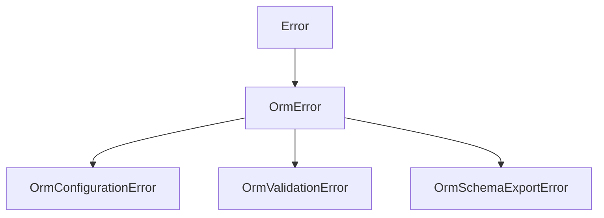

[@theokit/orm](/packages/theokit-orm.md) uses a shallow, three-branch hierarchy under
one base class.[^errors]

`catch (e) { if (e instanceof OrmError) ... }` catches everything from this package and
nothing from [@theokit/di](/packages/theokit-di.md), whose hierarchy is flat and
described in [container errors](/api/di-errors.md).

# The three branches

`OrmConfigurationError` — the wiring is wrong
: A developer or deployment mistake. It is not retryable and not user-facing; the fix
  is a code or configuration change.

`OrmValidationError` — the data or the outcome is wrong
: Bad input, or a write that did not affect the row it should have.

`OrmSchemaExportError` — a column cannot be represented
: Raised only by [schema export](/api/schema-export.md), for a column type outside the
  twelve mapped families.

The split matters at the boundary of a service: a configuration error is a 500 and a
page, while a validation error is usually a 400 or a domain-level decision.

# What throws what

| Site | Error | Trigger |
|---|---|---|
| `getRepositoryToken` | Configuration | entity is `null`/`undefined`, or has no resolvable name |
| `OrmModule.forRoot` | Configuration | missing options, missing `db`, or an unknown dialect |
| `OrmModule.forFeature` | Configuration | non-array, empty array, or `forRoot` not called first |
| `Repository` constructor | Configuration | table has no detectable primary key |
| `Repository.insert` / `.update` | Configuration | driver does not expose `.returning()` |
| `Repository.insert` | Validation | `.returning()` gave back zero rows |
| `Repository.update` | Validation | no row matched the id |
| `findById` / `update` / `delete` | Validation | id is null, empty, or not a string/number |
| `@Transactional` | Configuration | non-method target, unbound data source, or `db` without `.transaction()` |
| `exportSchema` | Schema export | unmapped column type |

# Messages carry the fix, not just the fault

Every message names the specific remedy rather than describing the failure. A few,
quoted from the source:[^module][^repo]

- `OrmModule.forFeature called before OrmModule.forRoot. Call OrmModule.forRoot(opts) first in your Container providers array.`
- `Entity "x" has no primary key. v0.1 requires a single-column PK named "id" or marked .primaryKey(). Use repo.query() for composite/custom keys.`
- `driver does not expose .returning(). v0.1 supports SQLite/Postgres. For MySQL, use repo.query() and manually fetch the inserted row.`

The pattern is worth preserving when adding errors here: state what is wrong, then the
one action that resolves it, and name the version boundary when the limit is a scope
decision rather than a defect.

# One gap in the hierarchy

`OrmError` declares `name` as `string` rather than a literal type, while its three
subclasses each pin a literal.[^errors] So narrowing on `err.name` works for the
subclasses but not for a bare `OrmError`. In practice nothing throws the base class
directly — every throw site above uses a subclass.

[^errors]: `@theokit/orm` error classes
[^repo]: Repository implementation
[^module]: `OrmModule` implementation
