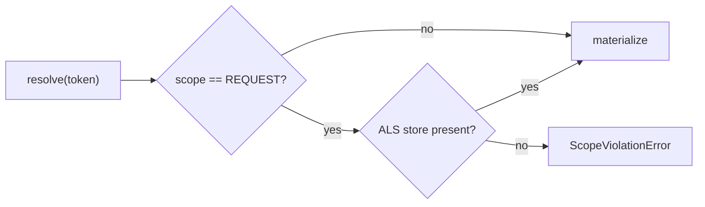

A scope decides how long a resolved instance lives and who shares it. There are
three, recorded as ADR D5.[^types]

```typescript
export const Scope = {
  SINGLETON: "singleton",
  TRANSIENT: "transient",
  REQUEST: "request",
} as const;
```

| Scope | One instance per | Cached in | Disposed when |
|---|---|---|---|
| `SINGLETON` | container | `singletonCache` | `container.dispose()` |
| `TRANSIENT` | `resolve()` call | nowhere | never tracked |
| `REQUEST` | `runInRequest` boundary | per-request store | the request boundary closes |

`SINGLETON` is the default for every provider shape that does not say otherwise.[^container]

# TRANSIENT never participates in disposal

This is the sharp edge. `storeInCache` explicitly does nothing for `TRANSIENT`, and
`trackInstance` only pushes onto the singleton or request instance lists — so a
`TRANSIENT` provider whose instances hold resources is never disposed by the
container.[^container] If a transient thing owns a socket or a file handle, the
calling code owns closing it.

# REQUEST scope needs an active boundary

Resolving a REQUEST-scoped provider outside
[`runInRequest`](/api/container.md) throws
[`ScopeViolationError`](/api/di-errors.md) — the container refuses to silently
degrade to a singleton.[^container]



The store lives in an `AsyncLocalStorage`, so it follows `await` chains but not raw
`setTimeout` / `setImmediate` callbacks that escape them.

# The single-flight promise cache

Concurrency inside a request is where a naive cache goes wrong, and the container
handles it deliberately. When a factory returns a Promise, the in-flight Promise
itself is written to the cache immediately, before it settles — so a second concurrent
caller awaits the same Promise instead of starting a second factory run. On
fulfilment the resolved value replaces the Promise and the instance is tracked for
disposal; on rejection the entry is deleted so a transient failure never poisons the
cache.[^container]

The synchronous path does the same caching before it throws
`AsyncProviderInSyncResolveError`. That looks odd until you see why: without it, the
async fallback would call the factory a second time, doubling resource creation and
leaking the first instance — it would never reach `trackInstance`, so `dispose()`
would never see it.[^container]

# Choosing one

Use `REQUEST` when isolation between concurrent callers is the point — the wedge case
being one Agent per HTTP request, described in
[one agent per HTTP request](/guides/request-scope-http.md).
[`createAgentProvider`](/api/agent-provider.md) defaults to it for exactly that
reason, and offers `SINGLETON` for CLI, cron and single-tenant setups where a shared
instance is fine.

Use `TRANSIENT` for cheap stateless helpers where sharing would be a correctness
problem, and accept that you handle their cleanup.

[^types]: `@theokit/di` public type contract
[^container]: Container implementation
