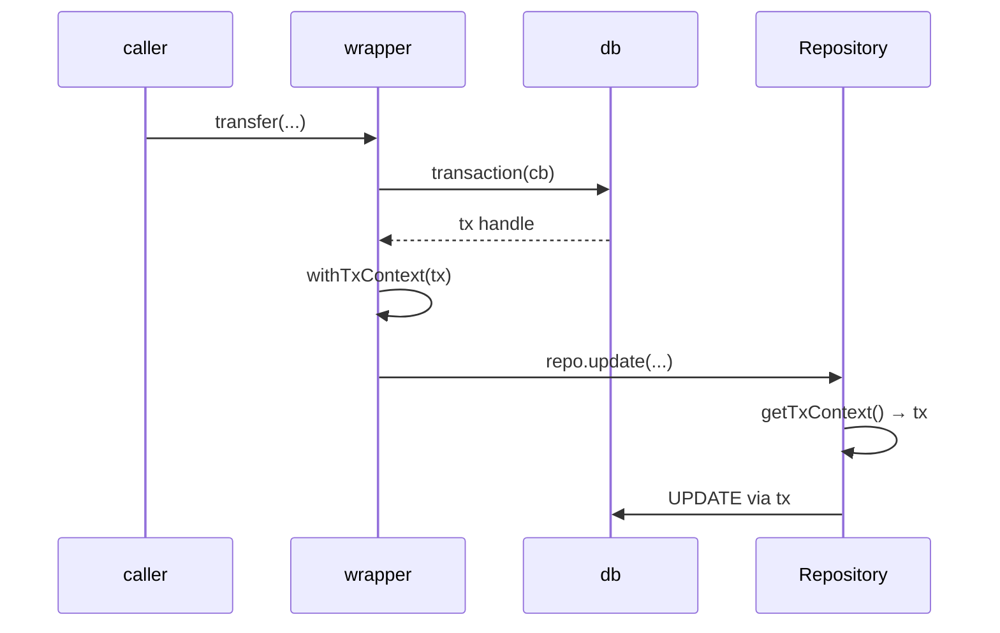

`@Transactional()` wraps a method so its whole body runs inside one database
transaction, committing on return and rolling back on throw.[^tx]

```typescript
@Injectable()
class TransferService {
  constructor(@InjectRepository(accounts) private readonly repo: Repository<typeof accounts>) {}

  @Transactional()
  async transfer(from: string, to: string, amount: number) {
    await this.repo.update(from, { balance: /* ... */ });
    await this.repo.update(to, { balance: /* ... */ });
  }
}
```

Before using it, read
[@Transactional has no DI binding path](/caveats/transactional-di-binding.md). The
decorator works, but the wiring its own documentation describes is not implemented.

# How propagation works

The decorator replaces the method with a wrapper that calls `db.transaction(cb)` and
runs the original inside `withTxContext(tx, ...)` — an `AsyncLocalStorage` holding the
transaction handle.[^tx]



[`Repository`](/api/repository.md) reads that context in its `db` getter and uses the
transaction handle instead of the default connection. Nothing is threaded through
parameters and no repository needs a transaction-aware variant.[^txctx]

The limit is the `AsyncLocalStorage` one, the same as
[REQUEST scope](/api/scopes.md): a raw `setTimeout` or `setImmediate` callback that
escapes the Promise chain loses the context, and any repository call inside it quietly
runs outside the transaction.

# Binding the data source

The wrapper finds its data source on the instance, under the symbol
`Symbol.for("Theo:orm:dataSource")`, written by:

```typescript
function bindDataSourceToInstance(instance: object, ds: DataSource): void;
```

An unbound instance throws [`OrmConfigurationError`](/api/orm-errors.md) on the first
call.[^tx] Note that `bindDataSourceToInstance` is **not exported from the package
barrel** — see the caveat.

# isolationLevel is accepted and ignored

```typescript
interface TransactionalOptions {
  isolationLevel?: "read uncommitted" | "read committed" | "repeatable read" | "serializable";
}
```

The parameter is named `_opts` in the implementation and never read. Passing an
isolation level compiles, type-checks, and has no effect on the transaction.[^tx] Set
isolation on the connection or through Drizzle directly if you need it.

# Failure modes

| Condition | Error |
|---|---|
| Applied to a non-method | `OrmConfigurationError`, at decoration time |
| No data source bound to the instance | `OrmConfigurationError`, at call time |
| `ds.db` has no `.transaction()` | `OrmConfigurationError`, at call time |
| The wrapped method throws | the original error, after rollback |

The rollback path re-throws the original error unchanged, so a domain error stays a
domain error — the transaction machinery does not wrap or replace it.[^tests]

[^tx]: `@Transactional` implementation
[^txctx]: Transaction `AsyncLocalStorage` context
[^tests]: `@Transactional` test suite
