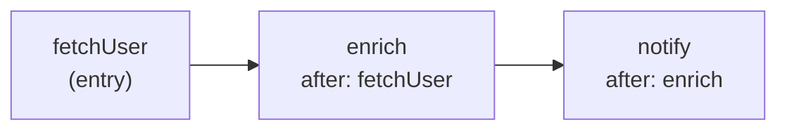

`buildWorkflow` is the only bridge in
[@theokit/di-agent](/packages/theokit-di-agent.md) that imports the SDK at runtime.
Every other module in the package is metadata-only; this one turns
[`@Step`](/api/agent-decorators.md) metadata into an executable `@theokit/sdk`
Workflow.[^builder]

```typescript
function buildWorkflow(instance: object): Workflow;
```

The design constraint it was built under is stated in its own header: it **composes**
the existing Workflow engine and adds no orchestration of its own — the same principle
as `createSquad`.[^builder] There is one workflow engine in the ecosystem, and it is
not in this package.

# Usage

```typescript
@Workflow({ name: "onboarding" })
class OnboardingFlow {
  @Step()
  async fetchUser(input: { id: string }) {
    return { user: await load(input.id) };
  }

  @Step({ after: "fetchUser" })
  async enrich(prev: { user: User }) {
    return { ...prev, score: await score(prev.user) };
  }
}

const workflow = buildWorkflow(new OnboardingFlow());
```

Each step receives the previous step's return value; an entry step receives the
workflow input. The workflow name comes from
[`@Workflow`](/api/agent-decorators.md), falling back to `"workflow"` when the class
has no decorator or no name.[^builder]

# The dependency model is a linear chain

`@Step({ after })` names a single upstream method. That is the entire graph vocabulary:
one dependency per step, no fan-out, no fan-in. Branching remains the imperative
`Workflow` surface.[^builder]



Steps are topologically sorted by `after` and emitted as a chain of `.then(...)` calls,
each wrapped in the SDK's `fn(id, ...)` helper. A step's id is its `name` option, or
the method name when omitted.

# It fails fast, before building anything

Validation runs to completion before the first `Workflow.create`, so a malformed class
never yields a half-built workflow.[^builder] Four conditions throw, each naming the
offending member:

| Condition | Message |
|---|---|
| No `@Step` methods on the class | `has no @Step methods` |
| A `@Step` property is not a function | `@Step "x" is not a method` |
| `after` names an unknown step | `declares after: "y" which is not a known @Step (unknown upstream)` |
| The `after` graph contains a cycle | `cycle detected in @Step "after" graph at "x"` |

These are plain `Error`s rather than typed classes — a difference from the
[container error hierarchy](/api/di-errors.md) worth knowing if you are catching them.

The topological sort detects cycles with a `visiting` set: a step re-entered while
still being visited is on a back edge. Because each step has at most one upstream, the
recursion depth is bounded by the chain length rather than by fan-out.[^builder]

# Where it came from

Shipped in `0.2.0` alongside `@Squad`. The ecosystem already had a workflow engine and
a decorator vocabulary, but nothing that compiled one into the other.[^changelog]

[^builder]: `buildWorkflow` implementation
[^tests]: `buildWorkflow` test suite
[^changelog]: `@theokit/di-agent` changelog
