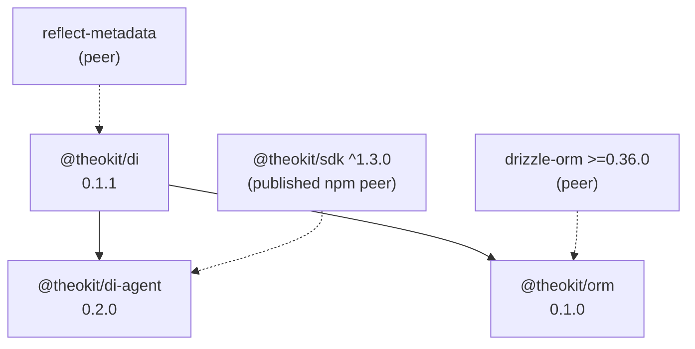

Three packages, one direction of dependency, no cycles.

Solid arrows are workspace dependencies; dotted arrows are peer dependencies the
consumer installs.[^manifests]

# Why the arrows point this way

[@theokit/di](/packages/theokit-di.md) is the root and depends on nothing but the
`reflect-metadata` polyfill. That is what lets it own
[`METADATA_KEYS`](/api/metadata-keys.md) — the shared key table both other packages
write into without depending on each other.

[@theokit/di-agent](/packages/theokit-di-agent.md) and
[@theokit/orm](/packages/theokit-orm.md) are siblings. Neither imports the other, and
nothing in the repository requires using both.

# The SDK boundary

`@theokit/sdk` is consumed as a **published npm dependency** (`^1.9.0` in dev, `^1.3.0`
as the declared peer range), not a workspace link.[^rootreadme] The two trees are built
and released independently, so a change here does not force an SDK release and vice
versa.

The coupling is also deliberately thin. Only
[`buildWorkflow`](/api/workflow-builder.md) imports the SDK at runtime; every
[agent decorator](/api/agent-decorators.md) is metadata-only, and
[`createAgentProvider`](/api/agent-provider.md) keeps its Agent type parameter
structural so it never names an SDK type.

Direction of the contract matters here: decorators are an **optional** DX layer. ADR
D431 revoked an earlier rule that made them mandatory, so the SDK does not require this
repository at all.[^rootreadme]

# Provenance of the monorepo

These three packages were extracted from `theokit-sdk` on 2026-06-18 under the plan
`monorepo-cohesion-split`, using `git filter-repo` to preserve full history. The
motivation was cadence: the SDK stays a cohesive Agent-AI harness while the DI and IoC
concerns evolve on their own schedule. npm names and versions were unchanged by the
move.[^rootchangelog]

`@theokit/http`, the HTTP decorator layer, lives in the sibling `theokit` repository
under `packages/http`. An earlier name, `@theokit/http-decorators`, no longer
exists.[^rootchangelog]

# Version compatibility

| Package | Version | Depends on |
|---|---|---|
| `@theokit/di` | 0.1.1 | — |
| `@theokit/di-agent` | 0.2.0 | `@theokit/di@^0.1.0-next.0`, `@theokit/sdk@^1.3.0` |
| `@theokit/orm` | 0.1.0 | `@theokit/di@^0.1.0`, `drizzle-orm@>=0.36.0` |

Both dependants sit in the `^0.1.x` range of the DI package, which is why additions to
`METADATA_KEYS` ship as patch releases: a `0.2.0` would leave that range and force both
to `1.0.0`. The reasoning is recorded on
[METADATA_KEYS](/api/metadata-keys.md).

# Build shape

Every package builds with `tsup` to dual ESM and CJS with `.d.ts` emitted, targets
Node 22, and marks its peers external.[^manifests] `@theokit/orm` is the only one with
two entry points — the main barrel and
[`schema-export`](/api/schema-export.md).

[^rootreadme]: theokit-di monorepo README
[^manifests]: The three package manifests
[^rootchangelog]: Workspace changelog
