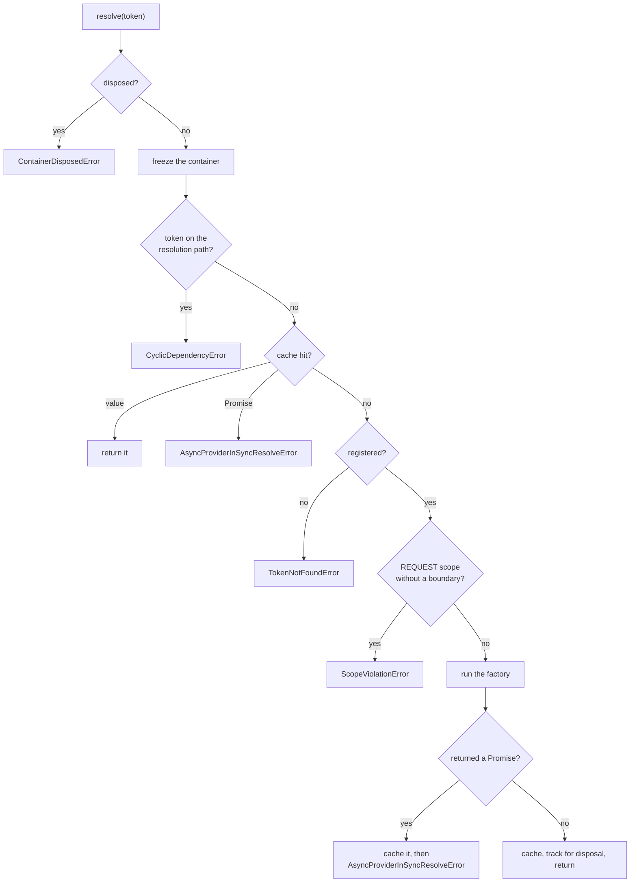

What [`Container.resolve`](/api/container.md) does, in order. The ordering is not
incidental — several steps sit where they do because an earlier arrangement produced a
specific bug, each recorded as an edge case in the changelog.[^changelog]

# The sequence



# Why cycle detection precedes the cache

In the asynchronous path a cycle would otherwise hit the
in-flight Promise left by its own outer resolve, and await a Promise that can only
settle after the awaiting call returns — a deadlock rather than an error.[^container]

Checking the path first turns that into `CyclicDependencyError` immediately. The
synchronous path uses the same order for symmetry.

# Why the container freezes on first resolve

`hasResolved` is set before any work happens, and every subsequent
`register()` throws unless `allowDynamicRegistration` was opted into.[^container]

Without it, a singleton constructed under one set of registrations coexists with a
later, different set — two halves of an application holding different implementations
of the same token, with nothing failing at the point of the mistake.

# Constructing a class

For a class provider the factory runs four steps:[^container]

1. Verify `reflect-metadata` is loaded, else `ReflectMetadataMissingError`.
2. Read `design:paramtypes`, `@Inject` overrides and `@Optional` flags.
3. If there are zero parameter types but the constructor declares parameters, throw a
   `TypeError` naming `emitDecoratorMetadata` — step 2 cannot distinguish "no
   dependencies" from "compiler emitted nothing", so the constructor's own `length`
   settles it.
4. Try resolving every parameter synchronously; fall back to `Promise.all` if any is
   async.

Per parameter, the token is the `@Inject` override if present, otherwise the emitted
type. A parameter whose emitted type is a
[primitive marker](/api/metadata-keys.md) with no override is `undefined` when
`@Optional`, and a `TypeError` naming the index otherwise.

# The sync-to-async fallback

`AsyncProviderInSyncResolveError` is used twice over, and the distinction is easy to
miss:

- As a **public error**, when a consumer calls `resolve()` on an async chain.
- As an **internal control-flow signal**, caught by `tryResolveSync` to mean "abandon
  the sync attempt, re-resolve this whole list through `resolveAsync`".[^container]

The retry deliberately re-resolves *every* parameter rather than resuming from the one
that failed, which keeps the logic simple at the cost of re-reading already-cached
values — cheap, because they are cache hits.

# The single-flight guarantee

The subtlest ordering in the file. The synchronous path caches
an in-flight Promise **before** throwing:[^container]

```typescript
this.storeInCache(token, value, registration.scope);
value.then(
  (resolved) => { this.storeInCache(token, resolved, ...); this.trackInstance(resolved, ...); },
  () => { this.deleteFromCache(token, ...); },
);
throw new AsyncProviderInSyncResolveError(token);
```

Caching before a throw looks wrong until you trace what happens without it: the async
fallback finds no cache entry, calls the factory a second time, and the first instance
is orphaned — never tracked, so `dispose()` never reaches it. Every resolve would create
and leak one extra instance.

The rejection handler deletes the entry rather than caching the rejected Promise,
so a transient failure does not poison the token for the container's
lifetime.

# Scope-aware caching

One lookup order, three storage behaviours:[^container]

| Scope | Read from | Written to |
|---|---|---|
| SINGLETON | `singletonCache` | `singletonCache` |
| REQUEST | the ALS store, if any | the ALS store, if any |
| TRANSIENT | never hits | nowhere |

`lookupCache` checks the singleton cache first, then the request store. Instances are
tracked for disposal only if they expose `dispose()` or `Symbol.asyncDispose` — which
is why TRANSIENT instances are never disposed by the container, as
[scopes](/api/scopes.md) sets out.

[^container]: Container implementation
[^metadata]: Metadata keys and readers
[^changelog]: `@theokit/di` changelog
