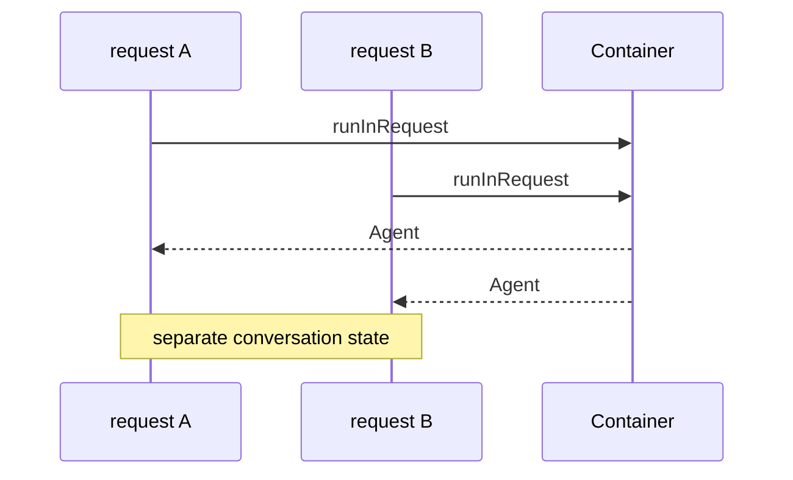

The wedge case of [@theokit/di-agent](/packages/theokit-di-agent.md): every HTTP
request gets its own Agent, with no request plumbing in the service code.

# The wiring

```typescript
import "reflect-metadata";
import { Agent } from "@theokit/sdk";
import { Container, Injectable, Module } from "@theokit/di";
import { InjectAgent, createAgentProvider } from "@theokit/di-agent";

@Injectable()
class ChatService {
  constructor(@InjectAgent() private readonly agent: Agent) {}

  async chat(message: string) {
    return this.agent.send(message);
  }
}

@Module({
  providers: [
    createAgentProvider({
      factory: () =>
        Agent.create({
          apiKey: process.env.OPENROUTER_API_KEY!,
          model: { id: "openai/gpt-4o-mini" },
        }),
    }),
    ChatService,
  ],
})
class AppModule {}

const container = new Container();
container.registerModule(AppModule);
```

`ChatService` never mentions requests, scopes or lifetimes. It declares that it needs
an Agent; the scope is a property of the provider, decided once at wiring
time.[^readme]

# The handler

```typescript
app.get("/chat", async (req, res) => {
  const result = await container.runInRequest(async () => {
    const chat = await container.resolveAsync(ChatService);
    return chat.chat(String(req.query.message));
  });
  res.json(result);
});
```

Three constraints are all visible in those four lines, and each has a distinct failure
mode:

| Constraint | If violated |
|---|---|
| `runInRequest` wraps the work | `ScopeViolationError` |
| `resolveAsync`, not `resolve` | `AsyncProviderInSyncResolveError` |
| The resolve happens *inside* the callback | The wrong instance, or a scope violation |

The third is the easy one to get wrong: resolving before opening the boundary and then
using the instance inside it defeats the isolation entirely.

# What isolation buys



Each request gets its own per-request cache and instance list. Two concurrent requests
never share Agent state, so one user's conversation history cannot leak into another's
reply.[^container]

The bundled Express example makes this assertable: each response includes its
`agentId`, and parallel `curl` calls must return different ones.[^example]

# The pitfall: escaping the async context

REQUEST scope rides on `AsyncLocalStorage`, which follows `await` chains but not
callbacks scheduled outside them.[^example]

```typescript
// broken — the ALS context does not reach the callback
await container.runInRequest(async () => {
  setTimeout(async () => {
    const chat = await container.resolveAsync(ChatService); // ScopeViolationError
  }, 0);
});

// fine — the whole chain stays inside the boundary
await container.runInRequest(async () => {
  await delay(0);
  const chat = await container.resolveAsync(ChatService);
});
```

The constraint is exact: middleware must wrap the *entire* handler, and the
handler must not escape the Promise chain through a raw `setTimeout` or `setImmediate`.

The same constraint governs [@Transactional](/api/transactional.md) and
[agent context columns](/api/agent-context.md), which use the same mechanism.

# Cleanup is automatic

`runInRequest` disposes every REQUEST-scoped instance in a `finally` block, so cleanup
happens even when the handler throws.[^container] Nothing in the handler needs a
`try/finally`.

Container-wide cleanup is separate and explicit:

```typescript
process.on("SIGINT", async () => {
  await container.dispose();
  process.exit(0);
});
```

That disposes singletons in reverse construction order — REQUEST-scoped instances are
already gone by then.[^example]

# When not to use REQUEST scope

For a CLI, a cron job or a single-tenant service, per-request isolation buys nothing
and costs an Agent construction per call. Pass `scope: Scope.SINGLETON` to
[`createAgentProvider`](/api/agent-provider.md) and drop `runInRequest`
entirely.[^readme]

[^example]: di-agent-express dogfood example, as it stood at commit c1781ee; the directory was removed from the tree in the following commit
[^readme]: `@theokit/di-agent` README
[^container]: Container implementation
